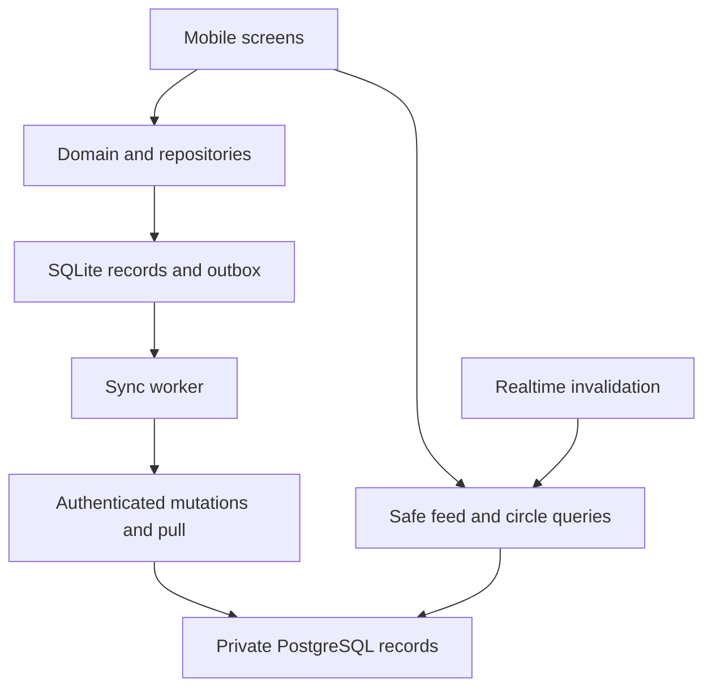

# Architecture

## Boundaries

The mobile UI reads personal activity from SQLite. A domain layer applies rules without React or network imports. A repository commits local records/outbox work. A sync service exchanges immutable requests with authenticated backend functions. Supabase PostgreSQL is the shared source of accepted account records. Public and circle reads use separate, sanitized projections and explicit authorization.



## Suggested repository structure after bootstrap

```text
apps/mobile/                 Expo project; owns its package.json and lockfile
  app/                       Routes and composition only
  src/components/            Token-based shared UI
  src/features/              Today, history, club, circles, account
  src/domain/                Pure validated types/calculations
  src/data/local/            SQLite migrations, repository, outbox
  src/data/remote/           Supabase adapters and response validation
  src/sync/                  Worker, cursors, conflict resolution
  src/services/              Auth, clock, notifications, telemetry
  src/theme/                 Generated/imported canonical design tokens
  src/testing/               Explicit test-only adapters
supabase/
  migrations/                Schema/functions/policies in versioned SQL
  functions/                 HTTP feed facade, deletion, abuse controls
  tests/                     Real SQL authorization and mutation tests
  seed.sql                   Local-only region and account fixtures
tests/e2e/                   Native scenario flows
docs/, design/, contracts/   This package, kept current
tracking/                    Progress and evidence
```

This layout is a target, not an existing app scaffold. Root package.json runs handoff checks only. Keep mobile dependencies under apps/mobile to avoid confusing handoff tests with product checks.

## Stack rules

Use a stable compatible Expo SDK at bootstrap; install native dependencies with Expo's compatibility-aware installer. Record exact SDK, React Native, Node, package manager, Supabase CLI, and test-tool versions in the evidence ledger and commit the generated lockfile. Re-check the official documentation before using version-dependent APIs. Do not hard-code an unverified future version from this document.

Use Expo Router, expo-sqlite, expo-secure-store, expo-notifications, expo-haptics and a compatible SVG library for the ring. Use the maintained Supabase JavaScript client. Add a schema validation library if it reduces duplicated validation. Avoid introducing a global state framework until needed; keep UI draft state local and persisted state behind repositories. Use query caching for remote community reads if helpful, with identity-aware cache keys.

## Auth storage and lifecycle

Use a tested secure storage adapter for session material, accounting for platform value-size constraints and rotation; never truncate tokens. If chunking is required, write versioned chunks plus an atomic manifest and clean abandoned chunks. Don't assume SecureStore alone gives cross-install account semantics. On a fresh install with no app installation marker, clear residual session keys before guest startup. Never store refresh tokens in ordinary analytics or error breadcrumbs.

Account API calls verify session and require a permanent account. V1 uses local guest mode, not Supabase anonymous sign-in. AppState controls auth auto-refresh according to current SDK guidance. Signout/account switch invalidates caches, subscriptions, pending requests and sync worker generation IDs. Late responses for the former account must be ignored.

## Backend and realtime

Private tables are not client-writable. Checked mutation functions are the write boundary. Owner reads use checked pull; sanitized feeds use rate-limited HTTP/RPC facade. Function execution privileges and table grants must be explicit.

Realtime carries only a coarse “refresh” signal for the selected public scope, never a private check-in payload. Coalesce signals to at most one per scope per 5 seconds; client refetches at most once per 10 seconds. Generic public signals do not identify people. Circles use authorized private topics and periodic membership revalidation; raw totals/identities must not be in broadcast payloads. Visibility changes/removals force refetch or clear cache. Poll every 30 seconds while foreground if subscription unavailable; stop when backgrounded. Reconnect always refetches because realtime is not a durable event log. [Authorization reference](https://supabase.com/docs/guides/realtime/authorization).

T15 uses the foreground polling fallback; no public realtime channel is configured and the UI never claims Live. Its reader enforces a ten-second floor across refresh, pagination and scope changes, honors Retry-After, and stops on tab blur/background/offline. Public pages live only in memory and are cleared on those transitions, identity/scope changes or errors; no public response is written into the directory cache. Refetch updates counts and removes ineligible displayed rows immediately, while new rows wait for explicit insertion. Pagination caps displayed rows at100; a changed/expired cursor resets the view for a safe first-page refetch.

## Performance and capacity targets

Engineering budgets to measure, not promises: local save confirmation under 150 ms p95 on a representative midrange device; warm Today render under 500 ms; feed first-page API under 1 second p95 in deployment region at initial beta load. Personal history paginates 30 days / 100 records; feed pages 25 with maximum 50. Avoid unbounded table scans and one query per member. Benchmark at 100k check-ins and a simulated 100 foreground feed clients before public beta; reassess indexes/limits from measurements.

Community aggregate queries initially use indexed records and bounded windows. Introduce cached aggregates only with reconciliation and privacy invalidation tests. Do not distribute every global write to every connected phone. Client caps, batching, scope subscriptions and bounded responses are part of V1.

## Failure boundaries

Local DB failure blocks save and preserves the draft. Network failure never blocks local tracking. Sync conflict preserves both values for resolution. Stale community data is labeled. Backend outage does not become a fake success or fake activity. App migrations are transactional and never “fixed” by deleting a real user's database.
